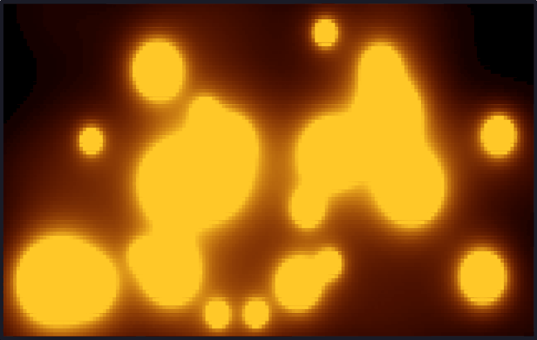

# rustylava

A terminal lava lamp simulation using metaballs, rendered with Unicode half-block characters and true color.



## Features

- Metaball physics with bouncing off walls
- Turbulence noise for organic lava movement
- True color (RGB) lava gradient rendering
- Configurable via CLI flags

## Requirements

A terminal with true color support (e.g. kitty, alacritty, wezterm, iTerm2).

## Installation

```sh
cargo install --path .
```

## Usage

```sh
rustylava [OPTIONS]
```

Press `q` to quit.

### Options

| Flag | Short | Default | Description |
|------|-------|---------|-------------|
| `--balls` | `-b` | `25` | Number of metaballs |
| `--min-radius` | | `5.0` | Minimum ball radius |
| `--max-radius` | | `20.0` | Maximum ball radius |
| `--speed` | `-s` | `0.5` | Max velocity per axis |
| `--fps` | `-f` | `30` | Target frames per second |

### Examples

```sh
# Default
rustylava

# Lots of small fast balls
rustylava --balls 50 --max-radius 8 --speed 1.5

# Slow, large blobs at 60 fps
rustylava --balls 8 --min-radius 12 --max-radius 30 --fps 60
```

## License

MIT
